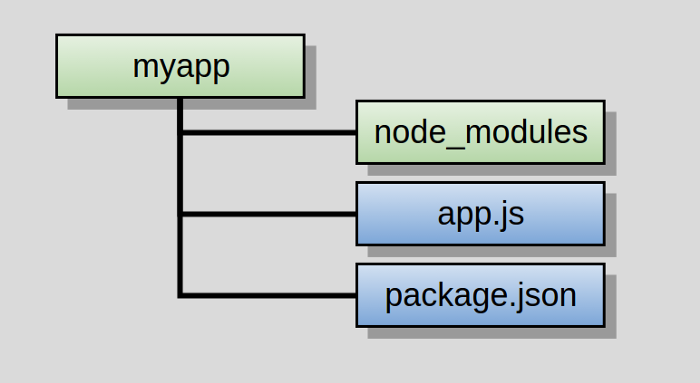

# APP with Node.js and Express

## What is Node.js?

Node is an asynchronous event driven JavaScript runtime built upon Chrome’s V8 JavaScript engine. It’s designed to build scalable network applications.
That being the raw definition, let me clarify. Node.js enables you to write server side JavaScript. You may now be wondering, how? As you know, JavaScript is a language which runs in a browser. The browser’s engine takes JavaScript code and compiles it into commands. The creator of Node.js took Chrome’s engine and built a runtime for it to work on a server. Don’t get confused with the word runtime. It’s an environment where the language can get interpreted. So what do we have now? A way to write JavaScript on the back end.
Regarding the definition, you might be wondering what the term asynchronous even means in the current context. JavaScript is single threaded, meaning there is only one thread of execution. So you don’t want events to interrupt the main thread of execution. This is what asynchronous means, handling events without interrupting the main thread. Node is based on this non-blocking execution, making it one of the fastest tools for building web applications today. In the following “Hello World” example, many connections can be handled concurrently. Upon each connection the callback is fired, but if there is no work to be done Node will remain asleep.

# Download Node

For MAC users install Homebrew, run

```
brew update
```

To update brew which is good practice before installing anything.

In your Terminal run

```
brew install node
```

To install node

If node is already installed

```
brew update node
```

To update to the latest version of node

# Open Terminal and Type

```
mkdir myapp
cd my app
```

These commands are universal for whatever OS you’ll be running. The former will create a new directory inside the directory you are currently in, mkdir = “make directory”. The latter will change into this newly created directory, cd = “change directory”. Hard-core windows users can calm down, this will work for you guys too, as it is equivalent to creating a new folder within your file system… only more fancy.

# Initialize your project and link it to npm

Now the real fun starts. After creating your directory, very innovatively named myapp, you will need to initialize a project and link it to npm.
Np-what? Okay, calm down. Npm is short for node package manager. This is where all node packages live. Packages can be viewed as bundles of code, like modules, which carry out a specific function. This functionality is what we as developers are utilizing. We use the application program interface, the API, provided for us by these modules.
Running this command initializes your project:

```
npm init
```

This creates a package.json file in your myapp folder. The file contains references for all npm packages you have downloaded to your project. The command will prompt you to enter a number of things.
You can enter your way through all of them EXCEPT this one:

```
entry point: (index.js)
```

You will want to change this to:

```
app.js
```

# Install Express in the myapp directory

While still in the myapp directory run:

```
npm install express --save
```

The install command will go ahead and find the package you wish to install, and install it to your project. You will now be able to see a node_modules folder get created in the root of your project. This is a crucial step, as you will be able to require any of the recently installed files in your own application files. The addition of —save will save the package to your dependencies list, located in the package.json, in your myapp directory.
Yeah, I know what you’re thinking. What exactly is this Express thing? Some mail delivery service, rivaling FedEx, I presume (please ignore these lame jokes). No, to burst your bubble, Express is a…
“Fast, unopinionated, minimalist web framework for Node.js” — Taken from Express.js’ official website
It gives you a set of robust and easy to use tools to get your web application up and running. Express has become so popular, it now is the de facto standard, in the vast majority of Node.js applications today. I strongly encourage the use of Express.

# Start your Text Editor choice and create a file named app.js

Writer the following:

```javascript
var express = require("express");
var app = express();
app.get("/", function (req, res) {
  res.send("Hello World!");
});
app.listen(3000, function () {
  console.log("Example app listening on port 3000!");
});
```

Here is where you will need to use the package which was recently installed. The first line declares a variable which will contain the module called express, grabbing it from the node_modules folder. The module is actually a function. Assigning the function call to another variable gives you access to a predefined set of tools which will in a great deal make your life much easier. You could view the variable app as an object, whose methods you are utilizing to build the actual program.
The listen method starts a server and listens on port 3000 for connections.
It responds with “Hello World!” for get requests to the root URL (/). For every other path, it will respond with a 404 Not Found.

# Run the APP

Type the command:

```
node app.js
```

After running the command, load http://localhost:3000/ in a browser to see the output. You should also see “Example app listening on port 3000!” get logged to the command line.

That’s it, you’re done. You have successfully created your first Node app. Don’t stop here, keep exploring the wonderful world of Node.js, as it has much more to offer.

Your finished app should have a folder structure somewhat resembling this.



Credit to _Adnan Rahić_ from Medium.com

# Additional Notes

## How to Add .gitignore to your project

```
Whenever you use npm , just go ahead and make .gitignore and put node_modules/ inside it. Easiest way I think about it ...
echo "node_modules/" >> .gitignore
The above will create the .gitignore file and write the text node_modules/ inside the file for you.
```

Credit to _Rome Bell_

## How to import your node module to project

Exports keyword gives you the chance to “export” your objects and methods, using

```
module.exports
```

We must recieve it using "require" in another file like follows:

const (insert relevant name here) = require('./filename');

we prefix the module name with ./. That indicates that the module is a local file.
